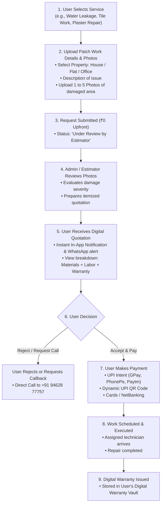
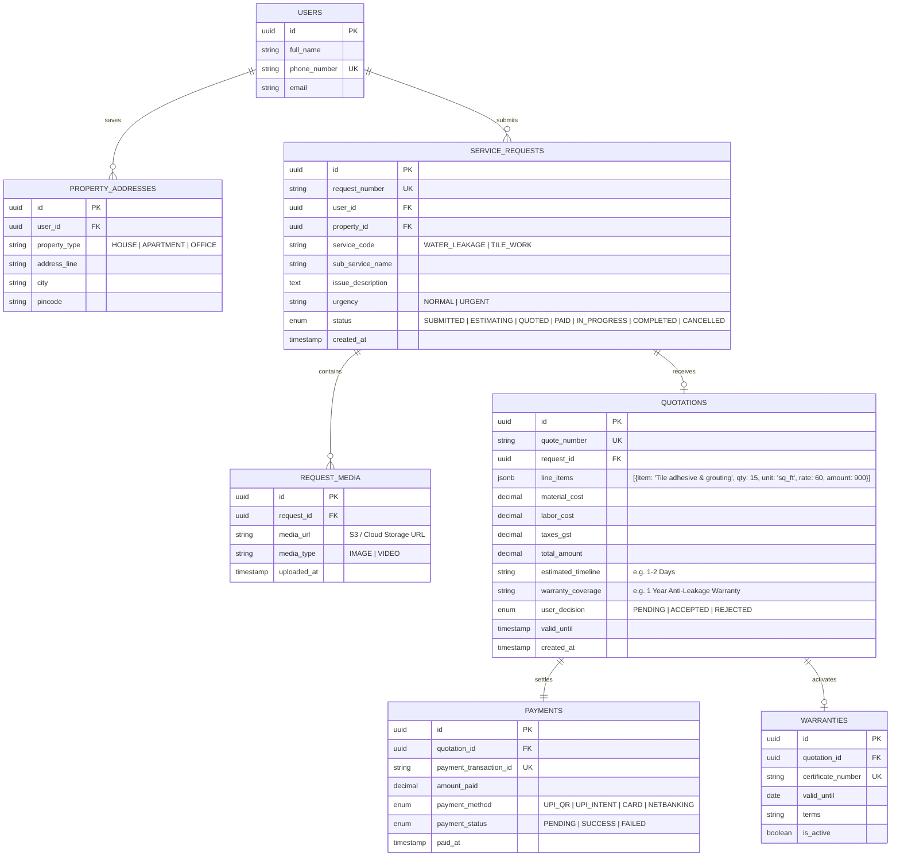

# System Architecture: Hind Building Solutions ("HiBuild / Hipro")
## **User Application — Dynamic Quotation & Photo-Inspection Architecture**

---

## 1. Core Workflow Principle: Dynamic Custom Quotation

**Prices are NOT fixed.** Because building repair and maintenance work depends heavily on the extent of damage, surface area, and required materials:

1. **User Submits Patch Work Details & Photos:** The customer selects a service, describes the issue, and uploads photos/images of the damaged area (e.g. wall seepage, ceiling crack, broken tiles, pipe leak).
2. **Team / Admin Evaluates & Generates Quotation:** The HiBuild estimation team reviews the uploaded photos and scope of work to generate an itemized digital quotation.
3. **User Reviews Quotation & Makes Payment:** The user reviews the breakdown (materials, labor, warranty terms) in the app. Once accepted, the user proceeds to payment (UPI / Dynamic QR / Cards).
4. **Work Execution & Digital Warranty:** Work is assigned and executed. A digital warranty certificate is generated upon completion.

---

## 2. End-to-End User Journey (Photo Upload to Payment)



---

## 3. Core Data Models (PostgreSQL + Prisma)

### 3.1 Entity Relationship Diagram



---

## 4. Prisma Schema Definition (Ready for Node.js)

Here is the exact **Prisma Schema** tailored to this workflow:

```prisma
datasource db {
  provider = "postgresql"
  url      = env("DATABASE_URL")
}

generator client {
  provider = "prisma-client-js"
}

enum PropertyType {
  HOUSE
  APARTMENT
  OFFICE
}

enum RequestStatus {
  SUBMITTED
  ESTIMATING
  QUOTED
  PAID
  IN_PROGRESS
  COMPLETED
  CANCELLED
}

enum QuoteDecision {
  PENDING
  ACCEPTED
  REJECTED
}

enum PaymentStatus {
  PENDING
  SUCCESS
  FAILED
}

model User {
  id           String            @id @default(uuid())
  phoneNumber  String            @unique
  fullName     String?
  addresses    PropertyAddress[]
  requests     ServiceRequest[]
  createdAt    DateTime          @default(now())
}

model PropertyAddress {
  id           String            @id @default(uuid())
  userId       String
  user         User              @relation(fields: [userId], references: [id])
  type         PropertyType      @default(HOUSE)
  addressLine  String
  city         String            @default("Bhilwara")
  pincode      String
  requests     ServiceRequest[]
}

model ServiceRequest {
  id               String         @id @default(uuid())
  requestNumber    String         @unique // e.g. "REQ-2026-0042"
  userId           String
  user             User           @relation(fields: [userId], references: [id])
  propertyId       String
  property         PropertyAddress @relation(fields: [propertyId], references: [id])
  serviceCode      String         // e.g. "WATER_LEAKAGE"
  subServiceName   String         // e.g. "Roof Leakage & Seepage"
  issueDescription String         // User explains what is broken
  media            RequestMedia[]
  status           RequestStatus  @default(SUBMITTED)
  quotation        Quotation?
  createdAt        DateTime       @default(now())
}

model RequestMedia {
  id         String         @id @default(uuid())
  requestId  String
  request    ServiceRequest @relation(fields: [requestId], references: [id], onDelete: Cascade)
  mediaUrl   String         // S3 / CDN URL
  createdAt  DateTime       @default(now())
}

model Quotation {
  id           String         @id @default(uuid())
  quoteNumber  String         @unique // e.g. "QTE-8921"
  requestId    String         @unique
  request      ServiceRequest @relation(fields: [requestId], references: [id])
  lineItems    Json           // Array of { item, qty, unit, rate, amount }
  materialCost Decimal        @db.Decimal(10, 2)
  laborCost    Decimal        @db.Decimal(10, 2)
  totalAmount  Decimal        @db.Decimal(10, 2)
  warranty     String?        // e.g. "1 Year Warranty"
  timeline     String?        // e.g. "Within 24 Hours"
  decision     QuoteDecision  @default(PENDING)
  payment      Payment?
  createdAt    DateTime       @default(now())
}

model Payment {
  id            String        @id @default(uuid())
  quotationId   String        @unique
  quotation     Quotation     @relation(fields: [quotationId], references: [id])
  transactionId String        @unique
  amount        Decimal       @db.Decimal(10, 2)
  paymentMethod String        // "UPI_QR", "PHONEPE", "GPAY"
  status        PaymentStatus @default(PENDING)
  paidAt        DateTime?
}
```

---

## 5. API Endpoints Required for the User App

### 1. `POST /api/v1/requests` (Create Service Request)
* **Multipart Form Data:**
  * `serviceCode`: e.g. `WATER_LEAKAGE`
  * `subServiceName`: e.g. `Roof & Bathroom Leakage`
  * `propertyId`: UUID of user's saved address
  * `issueDescription`: "Heavy water leakage near master bathroom wall during rain"
  * `files[]`: Up to 5 photos/images of the patch work
* **Response:** `{ "requestNumber": "REQ-2026-0042", "status": "SUBMITTED", "message": "Your request and photos have been received. We will prepare your custom quotation shortly." }`

### 2. `GET /api/v1/requests/my-requests` (Track Requests & Quotes)
* Returns the user's active requests and whether a quotation is ready for review.

### 3. `GET /api/v1/quotations/:requestId` (View Quotation)
* Returns the itemized quotation:
  ```json
  {
    "quoteNumber": "QTE-8921",
    "lineItems": [
      { "item": "Chemical waterproof coating", "qty": 180, "unit": "sq_ft", "rate": 45, "amount": 8100 },
      { "item": "Crack filling polymer sealant", "qty": 1, "unit": "tube", "rate": 650, "amount": 650 }
    ],
    "materialCost": 8750,
    "laborCost": 1500,
    "totalAmount": 10250,
    "warranty": "2 Years Seepage Warranty",
    "timeline": "Completion in 2 Days"
  }
  ```

### 4. `POST /api/v1/quotations/:id/respond` (Approve & Proceed to Payment)
* Body: `{ "decision": "ACCEPTED" }`
* Response: Returns Razorpay / UPI order details (dynamic UPI QR code & UPI Intent links for PhonePe/GPay/Paytm).

### 5. `POST /api/v1/payments/verify` (Confirm Payment)
* Verifies UPI payment completion $\rightarrow$ Updates request status to `PAID` $\rightarrow$ Triggers technician assignment.
